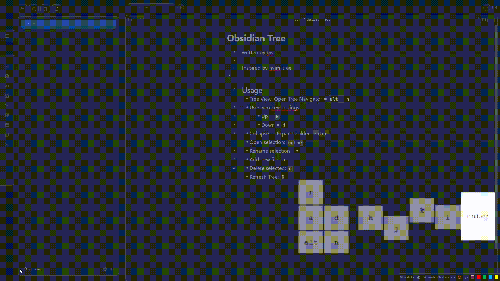

# Tree Navigator
A lightweight Obsidian plugin that adds a dedicated, keyboard-navigable tree view of your vault. Expand, collapse, and open folders and files without touching the mouse.

## Demo


## Features
- Persistent tree-view panel
- Keyboard navigation (j/k to move, Enter to expand/collapse or open)
- Recursive collapse of subfolders
- Create (a), Delete (d), Rename (r) directly from the tree
- Seamless integration with Obsidian’s workspace

## Installation
Install from Community Plugins (recommended)
- In Obsidian, go to Settings → Community Plugins → Browse
- Search for Tree Navigator
- Click Install, then Enable
Manual Install
- Build the plugin (see Development below)
- Copy the folder to
~/.obsidian/plugins/tree-navigator
- Enable it under Settings → Community Plugins

## Usage 
- j / ↓ : Move selection down
- k / ↑ : Move selection up
- Enter : Expand folder (collapsed) / Collapse folder (expanded) / Open file
- a : Create new file or folder (name ending with “/” makes a folder)
- d : Delete selected item
- r : Rename selected item
- R : Refresh tree
- Alt+N : Toggle Tree Navigator panel

## Development
Prerequisites
- Node.js ≥14
- npm (or yarn/pnpm)

## Get Started
### Clone locally
```
git clone https://github.com/brweinstein/obsidian-tree.git
cd obsidian-tree-navigator
```
### Install dependencies
```
npm install
```

### Build the plugin bundle
```
npm run build
```
### Watch for changes (optional)
```
npm run dev
```

After building, the output files main.js and styles.css will appear in the root. Link this folder into your vault’s plugins directory for testing.

## License
MIT